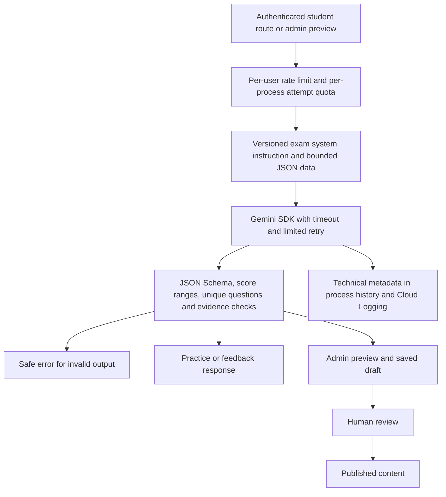

# AI harness flow

```mermaid
flowchart TD
    Routes["Authenticated student route or admin preview"]
    Limit["Per-user rate limit and per-process attempt quota"]
    Prompt["Versioned exam system instruction and bounded JSON data"]
    Gemini["Gemini SDK with timeout and limited retry"]
    Schema["JSON Schema, score ranges, unique questions and evidence checks"]
    Error["Safe error for invalid output"]
    Student["Practice or feedback response"]
    Draft["Admin preview and saved draft"]
    Review["Human review"]
    Published["Published content"]
    Logs["Technical metadata in process history and Cloud Logging"]
    Routes --> Limit --> Prompt --> Gemini --> Schema
    Gemini --> Logs
    Schema --> Error
    Schema --> Student
    Schema --> Draft --> Review --> Published
```

[Prompt management and evaluation coverage](../AI_HARNESS.md)
