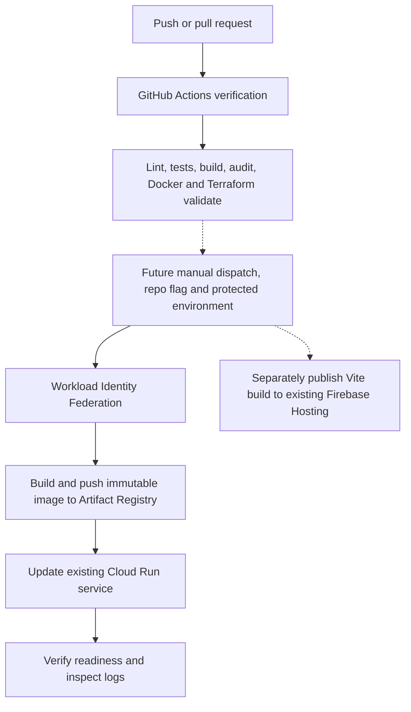

# Deployment flow

```mermaid
flowchart TD
    PR["Push or pull request"]
    CI["GitHub Actions verification"]
    Check["Lint, tests, build, audit, Docker and Terraform validate"]
    Authorize["Future manual dispatch, repo flag and protected environment"]
    WIF["Workload Identity Federation"]
    Image["Build and push immutable image to Artifact Registry"]
    Run["Update existing Cloud Run service"]
    Health["Verify readiness and inspect logs"]
    Front["Separately publish Vite build to existing Firebase Hosting"]
    PR --> CI --> Check
    Check -.-> Authorize
    Authorize --> WIF --> Image --> Run --> Health
    Authorize -.-> Front
```

Terraform bootstrap and first Cloud Run creation are separate future operations. The release job updates an existing API service. [Release guide](../GCP_DEPLOYMENT_GUIDE.md)
